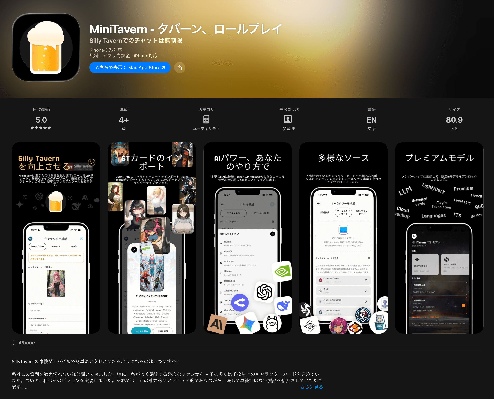

# スマホでSillyTavern！ 完全無料 MiniTavern | iPhoneアプリで超簡単スタート 2026年2月最新ガイド

SillyTavernは、KoboldAI/CPP、Horde、NovelAI、Ooba、Tabby、OpenAI、OpenRouter、Claude、Mistralなど、多数のLLM APIに統一されたインターフェースを提供します。今、MiniTavernを通じて、iPhoneで同じ強力な機能体験をお楽しみいただけます。

[MiniTavern App Store](https://mini-tavern.onelink.me/nPqv/wk127r7t)

## 多様なAIモデルに対応

MiniTavernは業界主流のAIモデルをサポートし、いつでもどこでもAIアシスタントと対話できます：

- **主流モデル完全対応**：OpenAI ChatGPT、Anthropic Claude、Google Gemini、xAI Grokなど
- **カスタムインターフェース**：OpenRouter、OllamaなどのOpenAI互換インターフェースに対応
- **柔軟な設定**：様々な使用シーンに合わせて、モデルを簡単に切り替え

## キャラクターカードの簡単インポート

- **内蔵サンプルキャラクター**：性別や性格が異なる複数のサンプルカードを内蔵、すぐに使える
- **SillyTavern互換**：SillyTavernのキャラクターカードを完全サポート
- **多様なインポート方法**：画像ファイルインポートとURLインポートに対応、便利で迅速

## 完全無料で利用可能

- **コア機能は永久無料**：基本的な対話機能は無料で利用可能
- **サブスクリプション会員オプション**：
  - 会員専用モデルリクエスト特典
  - リクエスト枠購入の専用割引
  - 広告なし体験
  - 無制限のカードスロット数

## オフライン対応

- **ローカルモデル互換**：ローカルモデルと組み合わせてオフライン使用可能
- **プライバシー保護**：データをローカルで処理し、プライバシーを保護

## その他の強力な機能

- **モバイルフレンドリーなインターフェース**：スマートフォン向けに最適化された操作体験
- **ビジュアルノベルモード**：没入感のある対話体験
- **画像生成統合**：Automatic1111 & ComfyUI APIに対応
- **音声合成（TTS）**：キャラクターに声を与える
- **WorldInfo（ナレッジベース）**：豊富なキャラクター背景を構築
- **自動翻訳**：言語の壁を越えたコミュニケーション
- **カスタマイズ可能なインターフェース**：あなた専用の使用体験を作成
- **無限の拡張可能性**：サードパーティ拡張機能でさらに多くの機能を実現

今すぐMiniTavernをダウンロードして、SillyTavernの強力な機能をポケットに！
