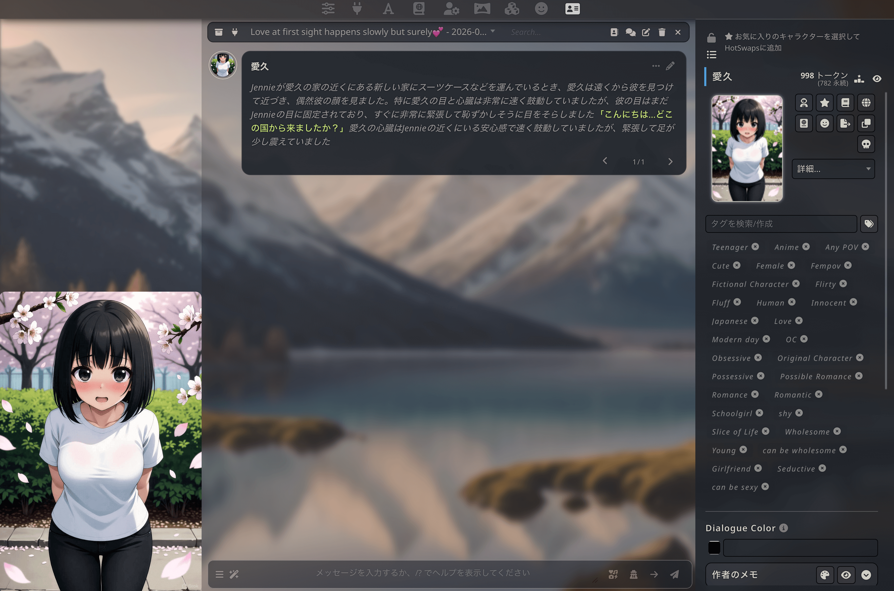
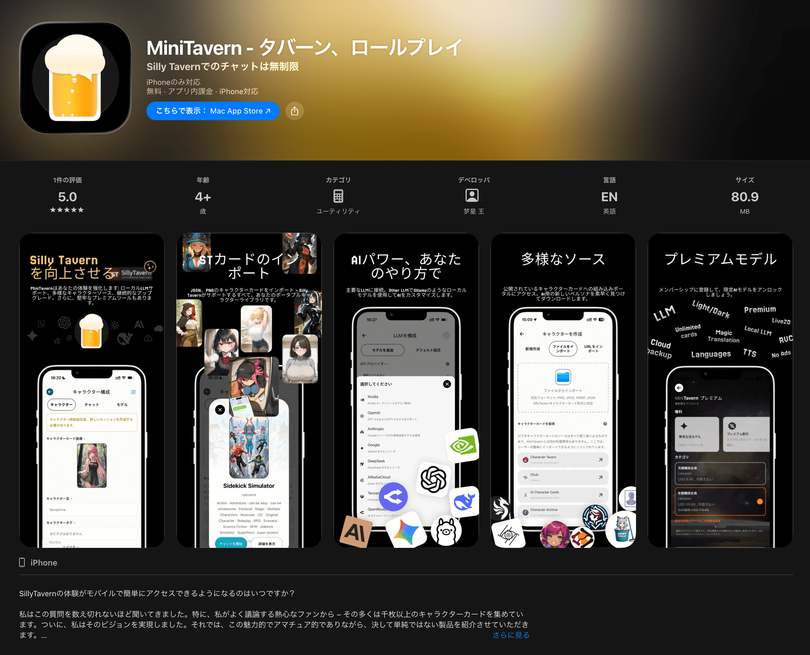

# スマホで SillyTavern（Silly Tavern）｜MiniTavern｜iPhone・Android 対応｜キャラクターカード（日本語）｜2026年最新ガイド

*最終更新日：2026年6月1日*

**SillyTavern**（Silly Tavern）は、KoboldAI/CPP、Horde、NovelAI、Ooba、Tabby、OpenAI、OpenRouter、Claude、Mistral など、多数の LLM API を一つの画面から扱える人気のフロントエンドです。  
日本語の **キャラクターカード** を探している方、**SillyTavern スマホ** で手軽に始めたい方、**SillyTavern キャラクター** や **SillyTavern character cards** をそのまま使いたい方に向けて、**MiniTavern** が iPhone と **Android** の両方で同じ系統の体験を提供します。

PC 版の設定が難しく感じる場合でも、**MiniTavern** ならアプリを入れて **SillyTavern 互換のキャラクターカード** を読み込み、すぐに会話を始められます。中国語圏では「酒馆」と呼ばれることもありますが、カード形式や RP の考え方は **SillyTavern** エコシステムと共通です。

## ダウンロード（iOS / Android）

| プラットフォーム | リンク |
|------------------|------|
| **iOS** | [App Store からダウンロード](https://mini-tavern.onelink.me/nPqv/wk127r7t) |
| **Android（Google Play・推奨）** | [Google Play で MiniTavern を開く](https://play.google.com/store/apps/details?id=com.kongyouwangluo.minitavern) |
| **Android（公式 GitHub トラッキング版 v1.4.9）** | [v1.4.9 リリースページ](https://github.com/minitavern/MiniTavern_Android/releases/tag/v1.4.9) |

> **Android の更新について：** 通常は **Google Play** を主導線としてください。ストア審査に時間差がある場合のみ、上記 **GitHub** の公式トラッキング版で最新の利用可能ビルドを取得できます。

---

## 多様な AI モデルに対応

MiniTavern は業界でよく使われるモデルに対応し、**SillyTavern スマホ** 利用でも設定を切り替えやすくしています。

- **主流モデル**：OpenAI（ChatGPT）、Anthropic（Claude）、Google Gemini、xAI Grok など  
- **カスタム接続**：OpenRouter、Ollama など OpenAI 互換エンドポイント  
- **用途に合わせた切り替え**：外出先でもモデルを変更しやすい UI  

---

## キャラクターカード（日本語・SillyTavern 互換）

**SillyTavern キャラクターカード** や **SillyTavern 日本語 キャラクター** 向けのワークフローに合わせたインポートをサポートします。

- **内蔵サンプル**：すぐ試せる複数のサンプルカード  
- **SillyTavern 互換**：`.png` / `.json` 形式の **character cards** をインポート  
- **インポート方法**：画像ファイルと URL の両方に対応  

日本語カードを集めているサイトやコミュニティから持ち込んだ **SillyTavern キャラクターカード 日本語** データも、形式が互換であればそのまま利用できます。

---

## コア機能は無料で利用可能

- **基本チャット・カードインポート**：コア体験は無料  
- **会員オプション（任意）**：広告非表示、枠の拡張など（詳細はアプリ内表示に準拠）  

---

## オフライン・プライバシー

- **ローカルモデル**：Ollama 互換など、環境に応じたオフライン利用  
- **端末内保存**：カードや設定は端末側で管理（アプリ内の説明に準拠）  

---

## その他の機能（抜粋）

- **モバイル向け UI**：スマートフォン操作に最適化  
- **ビジュアルノベル風の表示**：没入感のある会話画面  
- **WorldInfo（ロアブック）**：キャラクター背景の拡張  
- **TTS・画像連携など**：アプリ内で利用可能な機能はバージョンにより異なります  

---

## なぜ MiniTavern を選ぶのか（SillyTavern × スマホ）

デスクトップ版 **SillyTavern** は高機能ですが、**Termux** や Node 環境など、技術的な準備が必要になることがあります。  
**MiniTavern** は **SillyTavern スマホ** 向けの代替として、**Android** と iPhone の両方で「インストール → カード読み込み → 会話開始」まで短くまとめています。

今すぐ **MiniTavern** をダウンロードして、**SillyTavern** 系の RP をポケットに。

**公式サイト：** [https://mini-tavern.com](https://mini-tavern.com)

---

*最終更新日：2026年6月1日*
